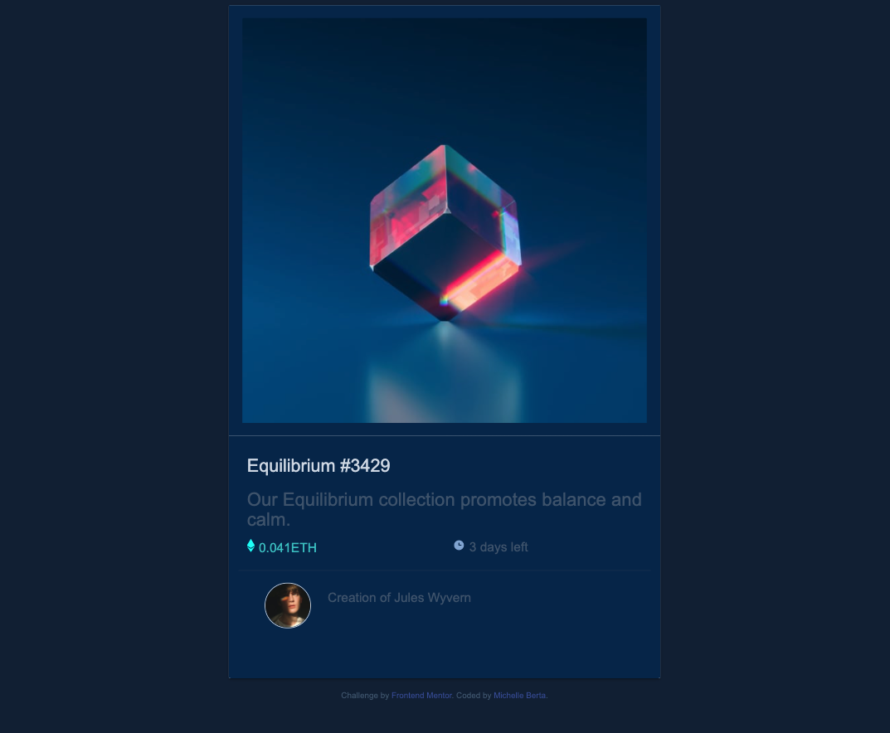

# Frontend Mentor - NFT preview card component solution

This is a solution to the [NFT preview card component challenge on Frontend Mentor](https://www.frontendmentor.io/challenges/nft-preview-card-component-SbdUL_w0U). Frontend Mentor challenges help you improve your coding skills by building realistic projects. 

## Table of contents

- [Overview](#overview)
  - [The challenge](#the-challenge)
  - [Screenshot](#screenshot)
  - [Links](#links)
  - [Built with](#built-with)
  - [Continued development](#continued-development)
  - [Useful resources](#useful-resources)
- [Author](#author)
- [Acknowledgments](#acknowledgments)

## Overview

The challenge was to build out this preview card component and get it looking as close to the design as possible.

### The challenge

Users should be able to:

- View the optimal layout depending on their device's screen size
- See hover states for interactive elements

### Screenshot

### Links

- Solution URL: [NFT-preview-card](https://michelleberta.github.io/nft-preview-card/)

### Built with

- Semantic HTML5 markup
- CSS custom properties
- Materialize CSS

### Continued development
I still have a lot to learn and a long way to go, but baby steps will get me there.  This is one small step.

### Useful resources

- [Materialize](https://materializecss.com/) - This website was very user friendly.  It made styling the card very easy.

## Author

- Website - [Michelle Berta](https://michelleberta.github.io/portfolio/)
- Frontend Mentor - [@MichelleBerta](https://www.frontendmentor.io/profile/MichelleBerta)

## Acknowledgments

Thank you to my daughter Nikki Everett, for helping me when I get stuck!
